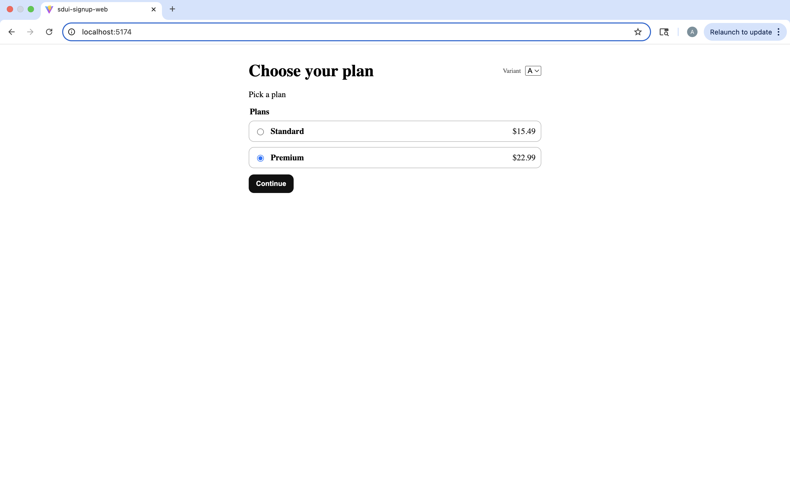

# Hybrid Server-Driven Signup Flow (SDUI)

A **hybrid server-driven UI experimentation platform** for building and testing multi-step signup flows where:

- The **server defines what to render** (schema, pages, copy, variants)
- The **client owns how it behaves** (state, validation, navigation, analytics, side effects)

This architecture enables rapid product iteration, A/B experimentation, and analytics instrumentation without redeploying the frontend.

---

## Why this project exists

Signup and onboarding funnels are among the most optimized surfaces in consumer products.

Small UI changes — pricing layout, copy positioning, validation friction — can significantly impact conversion.

Hybrid SDUI enables teams to:

- Run experiments safely
- Ship UI changes via config
- Instrument user behavior deeply
- Iterate without app redeploys

This mirrors experimentation platforms used at companies like Netflix and Amazon.

---

## Demo capabilities

- Variant A/B flows served from the server
- Dynamic plan configurations
- Client-side validation + navigation
- Time-on-page tracking
- Validation error instrumentation
- Conversion tracking
- Flow completion analytics

---

# Experiment Variants

## Variant A — Premium-first positioning


Focuses on anchoring users to higher-tier plans.

---

## Variant B — Expanded pricing ladder


Introduces lower entry pricing to test conversion elasticity.

---

# Flow Progression

### Account Creation


Schema-rendered input fields with validation + analytics instrumentation.

---

### Success State


Completion state used for conversion measurement.

---

# Architecture (Hybrid SDUI)

## Server (mocked via `mockServer.ts`)

Responsible for defining UI structure:

- Returns `SDUIFlow` JSON
- Defines pages + components
- Controls copy + options
- Injects experiment variants

```http
GET /flow?userId=123
```

The backend uses userId to deterministically assign experiment variants and return the corresponding flow configuration.

### Event Tracking

```http
POST /track
```

Captures analytics events such:
- page_enter / page_exit
- validation_error
- field_change
- experiment_exposure
- flow_complete


## Production Architecture

### Frontend
- **S3 + CloudFront** hosts the static React app globally.

### Flow Config Service
- `GET /flow?userId=...`
- **API Gateway → Lambda**
- Lambda returns a typed `SDUIFlow` JSON (same schema as `src/sdui/schema.ts`).
- store configs by `flowId + version` in DynamoDB.

### Analytics Pipeline (replaces server.ts)
- `POST /track`
- **API Gateway → Lambda**
- Lambda validates/enriches events and stores them.
- Storage options:
  - **DynamoDB** 

### Insights
- `GET /insights`
- **API Gateway → Lambda**
- Lambda returns aggregated metrics:
  - drop-offs by page
  - avg time per page
  - most common validation errors


