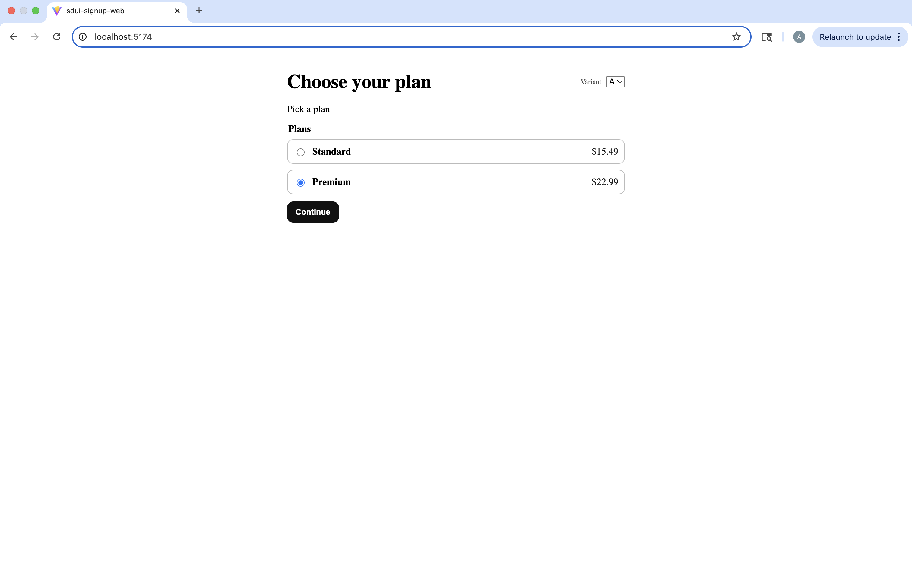
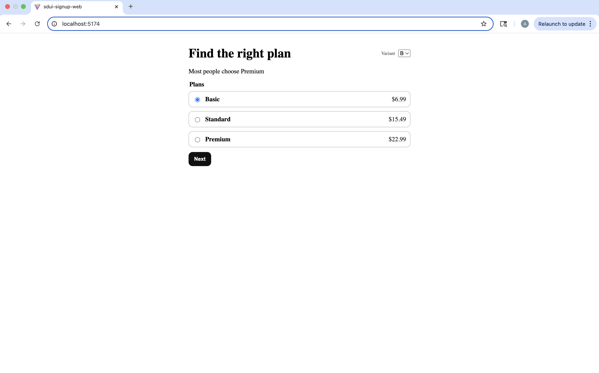
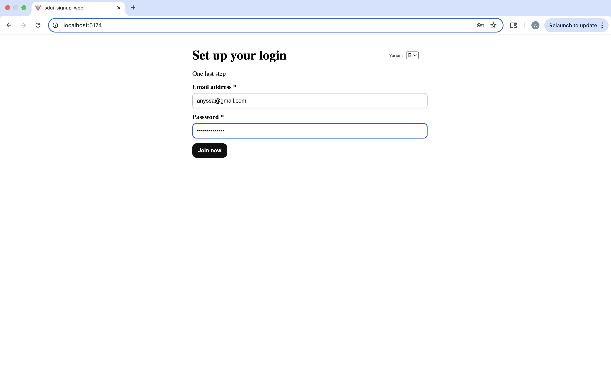
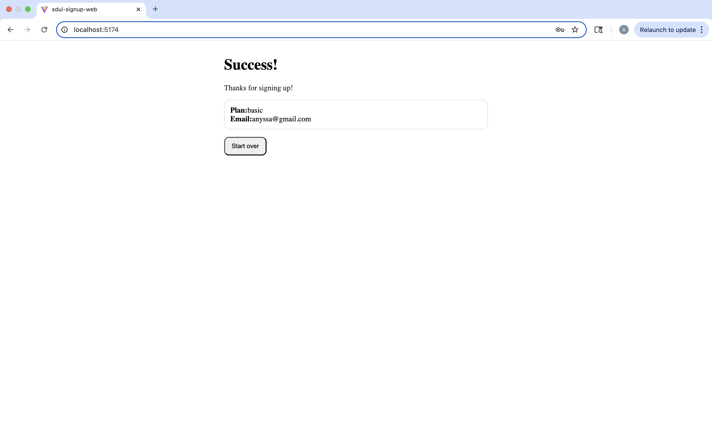

# Hybrid Server-Driven Signup Flow (SDUI)

A **hybrid server-driven UI experimentation platform** for building and testing multi-step signup flows.

- The **server defines what to render** (schema, pages, copy, variants)
- The **client controls behavior** (state, validation, navigation, analytics, side effects)

This architecture enables rapid iteration, safe experimentation, and deep analytics without requiring frontend redeploys.

---

## Why this project exists

Signup and onboarding funnels are among the highest-impact surfaces in consumer applications.

Small changes — pricing layout, copy, validation friction — can significantly affect conversion.

This project explores how teams can:

- Ship UI changes via configuration instead of code
- Run A/B experiments safely
- Instrument user behavior end-to-end
- Make data-informed product decisions

This approach mirrors experimentation systems used at companies like Amazon and Netflix.

---

## Demo Capabilities

- Server-driven A/B variants (deterministic user bucketing)
- Dynamic UI rendering from typed schema
- Client-side validation and navigation control
- Time-on-page tracking
- Validation error instrumentation
- Conversion + funnel analytics

---

# Experiment Variants

## Variant A — Premium-first positioning


Anchors users to higher-tier plans.

---

## Variant B — Expanded pricing ladder


Introduces lower entry pricing to test conversion elasticity.

---

# Flow Progression

### Account Creation


Schema-driven form rendering with validation and analytics instrumentation.

---

### Success State


Terminal state used to measure conversion.

---

# Architecture (Hybrid SDUI)

## Flow Configuration Service

```http
GET /flow?userId=123


